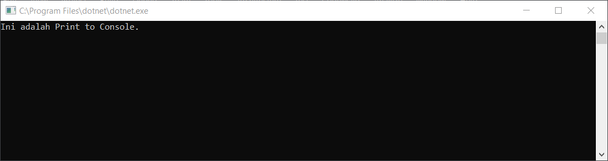
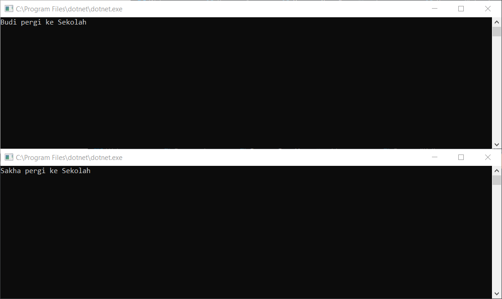
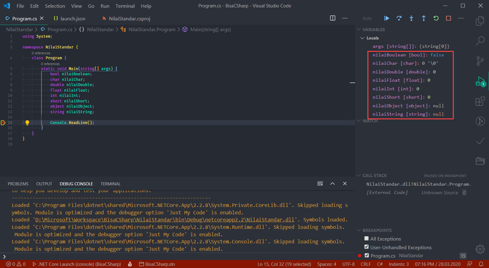
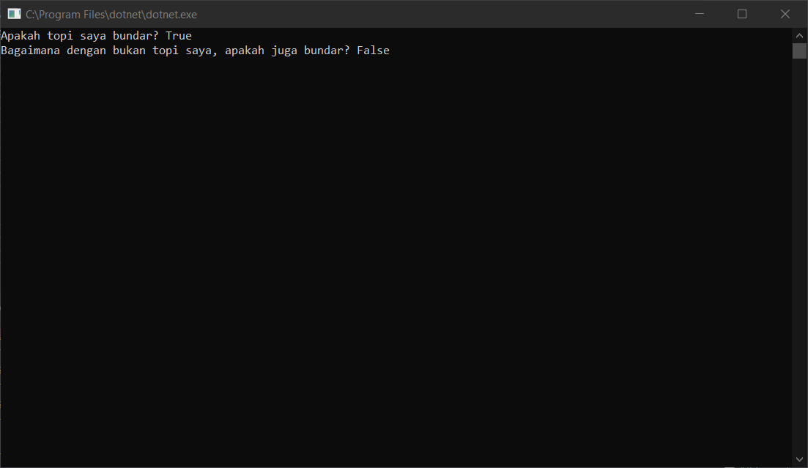

---
tags:
- CSharp
- C#
- Draft
date: 2021-08-14
---

<p>
  <h1 style="text-align:center;font-size:1.25em;margin-top:24px;margin-bottom:16px;font-weight:600;line-height:1.25">Kelompok Belajar Bunga Matahari</h1>
  <h3 style="text-align:center;font-size:16px;margin-top:0;margin-bottom:16px;line-height:1.5">Coding sudah seharusnya menyenangkan!</h3>
  <h5 style="text-align:center;font-size:16px;margin-top:0;margin-bottom:16px;line-height:1.5">
    <a href="https://github.com/asakura89">asakura89</a> /
    <a href="https://opensource.org/licenses/0BSD">BSD Zero Clause</a>
  </h5>
</p>


# Perkenalan CSharp

- [1. Entry Point](#1-entry-point)
- [2. Constructor](#2-constructor)
- [3. Deklarasi](#3-deklarasi)
- [4. Inisialisasi](#4-inisialisasi)
  - [4.1. Array Initializer](#41-array-initializer)
  - [4.2. Collection Initializer](#42-collection-initializer)
  - [4.3. Object Initializer](#43-object-initializer)
  - [4.4. Property Initializer](#44-property-initializer)
  - [4.5. Index Initializer](#45-index-initializer)
- [5. Print to Console](#5-print-to-console)
- [6. Membuat Library](#6-membuat-library)
- [7. Membuat variabel dan memberi nilai](#7-membuat-variabel-dan-memberi-nilai)
- [8. Nilai standar](#8-nilai-standar)
- [9. Nilai tetap](#9-nilai-tetap)
- [10. Field](#10-field)
- [11. Property](#11-property)
  - [11.1 Property Normal](#111-property-normal)
  - [11.2 Auto-Implemented Property](#112-auto-implemented-property)
- [12. Indexer](#12-indexer)


## 1. Entry Point

Semua apps yang dibuat pake C# .NET, atau .NET tanpa memandang bahasa lebih tepatnya, memiliki entry point. Terkecuali web, atau yang dibuat dengan ASP .NET. 
Karena web apps memiliki life cycle (urutan suatu web app dieksekusi). Apps yang berjenis desktop, kaya WinForm, WPF, dan Console, entry point-nya dimulai dari method `Main`.  

```c#
class Program {
    static void Main(string[] args) {
        // ^ Method ini adalah Entry Point.
    }
}
```


## 2. Constructor

Sewaktu class dipanggil, baris code yang pertama kali dijalanin adalah baris code yang ada di `constructor`. `constructor` adalah method dengan nama yang sama dengan nama class, tapi gak punya return value. 
Atau gak ada nilai yang balikin dari method itu. Biasanya method ini punya keyword `void` (method yang gak balikin nilai). Tapi `constructor` ini method khusus, jadi gak punya keyword `void` juga.  

```c#
class Program {
    public Program() {
        // ^ Method ini adalah constructor,
        // namanya sama dengan nama class dan gak punya return value
    }

    static void Main(string[] args) {
        var program = new Program();
        // sewaktu class Program dipanggil, constructor dari class itu akan dieksekusi duluan
    }
}
```


## 3. Deklarasi

Tahap deklarasi adalah tahapan sewaktu variabel dibuat. Apakah diberi nilai atau enggak.

```c#
class Program {
    static void Main(string[] args) {
        // Deklarasi variabel
        int permenDiTanganKiri;
        int permenDiTanganKanan = 3;
    }
}
```


## 4. Inisialisasi

Tahap inisialisasi adalah tahapan sewaktu variabel diberi nilai.

```c#
class Program {
    // Deklarasi variabel
    int jariKakiKiri;
    int jariKakiKanan;

    public Program() {
        // Inisialisasi variabel
        jariKakiKiri = 5;
        jariKakiKanan = 5;
    }

    static void Main(string[] args) {
        int permenDiTanganKiri; // → hanya deklarasi
        int permenDiTanganKanan = 3; // → deklarasi dan inisialisasi
    }
}
```

### 4.1. Array Initializer

```c#
class Program {
    static void Main(string[] args) {
        var arrayPertama = new string[3];
        var arrayKedua = new string[3] { "Ini", "array", "kedua" };
        var arrayKetiga = new string[] { "Ini", "aray", "ketiga" };
        var arrayKeempat = new[] { "Ini", "array", "keempat" };
        var arrayKelima = { "Ini", "array", "kelima" }; // → gak akan bisa di-compile karena gak ada informasi type. walaupun C# udah mulai merambah ke dynamic typing, sejatinya C# tetap bahasa strong-typed.
        string[] arrayKeenam = { "Ini", "array", "keenam" };
    }
}
```

Mudah kan?
Bandingin sama yang ini coba

```c#
class Program {
    static void Main(string[] args) {
        string[] arrayPertama = new string[3];
        arrayPertama[0] = "Ini";
        arrayPertama[1] = "array";
        arrayPertama[2] = "pertama";
    }
}
```


### 4.2. Collection Initializer

Ini mirip sama `Array Initializer`. Cuma, ini untuk collection, bukan untuk array.

```c#
class Program {
    static void Main(string[] args) {
        var collectionPertama = new List<String> { "Ini", "collection", "kedua" };
        var collectionKedua = new Dictionary<Int32, String> {
            { 1, "One" },
            { 2, "Two" },
            { 3, "Three" }
        };

        List<String> collectionKetiga = { "Ini", "collection", "kedua" };  // → gak akan bisa di-compile karena bagian initialize value-nya akan otomatis dideteksi sebagai `Array Initializer`.
        List<String> collectionKeempat = new { "Ini", "collection", "kedua" };  // → gak akan bisa di-compile karena bagian initialize value-nya akan otomatis dideteksi sebagai `Anonymous Type Initializer`.

        Dictionary<Int32, String> collectionKelima = {
            { 1, "One" },
            { 2, "Two" },
            { 3, "Three" }
        }; // → gak akan bisa di-compile karena bagian initialize value-nya akan otomatis dideteksi sebagai `Array Initializer`.

        Dictionary<Int32, String> collectionKeenam = new {
            { 1, "One" },
            { 2, "Two" },
            { 3, "Three" }
        }; // → gak akan bisa di-compile karena bagian initialize value-nya akan dianggap syntax error.
    }
}
```

Bandingin sama yang ini

```c#
class Program {
    static void Main(string[] args) {
        List<String> collectionPertama = new List<String>();
        collectionPertama.Add("Ini");
        collectionPertama.Add("collection");
        collectionPertama.Add("kedua" );

        Dictionary<Int32, String> collectionKedua = new Dictionary<Int32, String>();
        collectionKedua.Add(1, "One");
        collectionKedua.Add(2, "Two");
        collectionKedua.Add(3, "Three");
    }
}
```

Uniknya dari `Array Initializer` dan `Collection Initializer` udah ada dari jaman C# 1.0 dan .NET Framework 1.0.


### 4.3. Object Initializer

```c#
public class Koordinat {
    public Double Lintang { get; set; }
    public Double Bujur { get; set; }
}

public class TitikTempat : Koordinat {
    public String NamaTempat;
}

class Program {
    static void Main(string[] args) {
        var tujuan = new TitikTempat {
            Lintang = -6.1753924,
            Bujur = 106.8249641,
            NamaTempat = "Monumen Nasional"
        };

        var tujuanAnon = new {
            Lintang = -6.1753924,
            Bujur = 106.8249641,
            NamaTempat = "Monumen Nasional"
        }; // → ini juga valid. ini disebut Anonymous Type Initializer.
    }
}
```

Sebagai perbandingan

```c#
public class Koordinat {
    public Double Lintang { get; set; }
    public Double Bujur { get; set; }
}

public class TitikTempat : Koordinat {
    public String NamaTempat;
}

class Program {
    static void Main(string[] args) {
        TitikTempat tujuan = new TitikTempat();
        tujuan.Lintang = -6.1753924;
        tujuan.Bujur = 106.8249641;
        tujuan.NamaTempat = "Monumen Nasional";
    }
}
```

Object Initializer ini bisa dipake buat nge-initialize Property atau Field ketika suatu Object di-create.


### 4.4. Property Initializer

Property Initializer ini memungkinkan untuk menetapkan nilai standar buat `auto-implemented property`.

```c#
class Program {
    static void Main(string[] args) {
        var clarissa = new Clarissa();
        Console.WriteLine(clarissa.Tinggi);
        Console.WriteLine(clarissa.Berat);
        Console.WriteLine(clarissa.Mata);
        Console.WriteLine(clarissa.Rambut);
    }

    public class Clarissa {
        public Single Tinggi { get; set; } = 152.0f;
        public Single Berat { get; set; } = 87.8f;
        public String Mata { get; set; } = "Hitam";
        public String Rambut { get; set; } = "Hitam";
        public String CatRambut { get; set; }
    }
}
```

Terus. Terus. Kalo property-nya mau di-set nanti aja gimana? Ya bisa aja. Silakan aja tergantung kebutuhan.

```c#
class Program {
    static void Main(string[] args) {
        var clarissa = new Clarissa();
        Console.WriteLine(clarissa.Tinggi);
        Console.WriteLine(clarissa.Berat);
        Console.WriteLine(clarissa.Mata);
        Console.WriteLine(clarissa.Rambut);

        clarissa.CatRambut = "Ungu Cerah";
        Console.WriteLine(clarissa.CatRambut);
    }

    public class Clarissa {
        public Single Tinggi { get; set; } = 152.0f;
        public Single Berat { get; set; } = 87.8f;
        public String Mata { get; set; } = "Hitam";
        public String Rambut { get; set; } = "Hitam";
        public String CatRambut { get; set; }
    }
}
```

Ini sangat berguna ketika kita ingin memastikan bahwa suatu objek selalu memiliki status yang valid misalnya, bahkan walaupun beberapa properti tidak di-set secara eksplisit.


### 4.5. Index Initializer

Object yang mau implemen Index Initializer ini, `class`-nya harus punya accessible `Indexer`.

Misal kaya gini

```c#
class Program {
    static void Main(string[] args) {
        var collectionPertama = new List<String>(3) {
            [0] = "Ini",
            [1] = "collection",
            [2] = "pertama"
        }; // → Ini compile error. Walaupun IList punya Indexer, tapi dia gak bisa pake Index Initializer. Karena Ketika List di-initialize, isinya masih kosong sampe diisi dengan `value` menggunakan method `.Add`.

        var collectionKedua = new List<String>(3);
        Int32 idx = 0;
        while (idx < 3) {
            collectionKedua.Add(null);
            idx++;
        }
        collectionKedua[0] = "Ini";
        collectionKedua[1] = "collection";
        collectionKedua[2] = "kedua";
         // ^ Ini code yang valid, tapi ini bukan teknik `Index Initializer`

        var collectionKetiga = new Dictionary<Int32, String> {
            [1] = "One",
            [2] = "Two",
            [3] = "Three"
        };
    }
}
```

Fitur ini baru mulai ada dari C# 6 dan butuh .NET Framework 4.6 atau .NET Core 1.0.


## 5. Print to Console

Apa itu `Console`? `Console` adalah program yang beroperasi di lingkungan text hitam putih. Biasanya program-program yang dibuat bekerja di lingkungan ini adalah program yang kecil, simpel, dan melakukan operasi yang gak kompleks. 
Atau bisa juga untuk program yang gak perlu banyak input dari pengguna.  

Nah lalu yang dimaksud dengan Print to Console disini, gak ada hubungannya dengan nge-print ke kertas. Tapi maksudnya adalah, menampilkan ke `console`. Atau menampilkan ke text hitam putih.  

```c#
class Program {
    static void Main(string[] args) {
        Console.WriteLine("Ini adalah Print to Console.");
        Console.ReadLine();
    }
}
```




## 6. Membuat Library

Library disini adalah file `.dll`. Atau file yang bisa digunakan program yang lain. 
Misalkan ada program A mau nampilin kalimat "Budi pergi ke Sekolah". Terus ada program B mau nampilin kalimat yang mirip, yaitu "Sakha pergi ke Sekolah".
Karena secara pola, kedua program itu sama-sama ngelakuin hal yang sama, cuma beda di nama orangnya aja. 
Maka bagian yang ngoperasiin buat nampilin kalimat "pergi ke Sekolah" bisa diekstrak dari kedua program tadi ke satu file yang lain yang nantinya bisa dipanggil dan jalanin operasi yang dipanggil tadi.

```c#
class ProgramA {
    static void Main(string[] args) {
        Console.WriteLine("Budi pergi ke Sekolah.");
        Console.ReadLine();
    }
}
```

```c#
class ProgramB {
    static void Main(string[] args) {
        Console.WriteLine("Sakha pergi ke Sekolah.");
        Console.ReadLine();
    }
}
```

Sebelum bagian program buat nampilin kalimat dipisah, kedua program itu code-nya bakal kaya di atas ini. 
Tapi abis dipisah jadi kaya di bawah.  

```c#
namespace LibraryKalimat {
    public class PenampilKalimat {
        public void TampilkanKalimat(string nama) {
            Console.WriteLine($"{nama} pergi ke Sekolah");
        }
    }
}
```

```c#
using LibraryKalimat;

class ProgramA {
    static void Main(string[] args) {
        var penampil = new PenampilKalimat();
        penampil.TampilkanKalimat("Budi");
        Console.ReadLine();
    }
}
```

```c#
using LibraryKalimat;

class ProgramB {
    static void Main(string[] args) {
        var penampil = new PenampilKalimat();
        penampil.TampilkanKalimat("Sakha");
        Console.ReadLine();
    }
}
```




## 7. Membuat variabel dan memberi nilai

Semua operasi app pasti butuh variabel. Semua nilai yang di dibaca dari file, diambil dari database, atau bisa juga dari internet, disimpan ke memory untuk dipake di dalem app dengan menggunakan variabel. 

```c#
class Program {
    static void Main(string[] args) {
        string nama1 = "Sakha";
        Console.WriteLine($"Namaku adalah {nama1}");

        var nama2 = "Sakha";
        Console.WriteLine($"Namaku adalah {nama2}");

        dynamic nama3 = "Sakha";
        Console.WriteLine($"Namaku adalah {nama3}");

        Console.ReadLine();
    }
}
```


## 8. Nilai standar

Kalo variabel gak diberi nilai, secara otomatis variabel itu akan diberi nilai standar / default value.

```c#
class Program {
    static void Main(string[] args) {
        bool nilaiBoolean;
        char nilaiChar;
        double nilaiDouble;
        float nilaiFloat;
        int nilaiInt;
        short nilaiShort;
        object nilaiObject;
        string nilaiString;

        // Console.WriteLine($"Nilai standar dari boolean: {nilaiBoolean}");
        // ^ compile-time error

        Console.ReadLine();
    }
}
```

Nilai standar dari code di atas adalah:

* `nilaiBoolean` → `false`
* `nilaiChar` → `\0` (Unicode untuk karakter `null`)
* `nilaiDouble` → `0`
* `nilaiFloat` → `0`
* `nilaiInt` → `0`
* `nilaiShort` → `0`
* `nilaiObject` → `null`
* `nilaiString` → `null`

Kalo mau ngeliat nilai standar sebelum diinisialisai, cuma bisa diliat lewat `debug mode`. Di VS Code sendiri ada fitur `variables`. 
Karena kalo variabelnya ditampilin / di-print ke console, bakal ada error message sewaktu di-compile. Jadi gak bisa di-compile terus dijalanin. 
Error ini adalah error dari compiler yang ditampilin sewaktu ada variabel yang mau dipake tapi gak diinisialisasi dulu.




## 9. Nilai tetap

Sama kaya namanya, nilai tetap ini gak bisa diubah setelah diberi nilai. Ada 2 nilai tetap di C#. Yang satu `readonly`. Yang satu lagi `const`. 
Bedanya kalo `const`, nilainya sama sekali gak bisa diubah dan gak diambil dari variabel manapun. Jadi nilainya adalah nilai dirinya sendiri. 
Sedangkan `readonly`, nilainya cuma bisa diberi / diisi sebaris / inline sewaktu deklarasi atau di `constructor`.

```c#
class Program {
    const bool bundar = true;

    readonly bool topiSaya = bundar;
    readonly bool bukanTopiSaya;

    public Program() {
        bukanTopiSaya = bundar == false;

        // bundar = false;
        // ^ compile-time error

        Console.WriteLine($"Apakah topi saya bundar? {topiSaya}");
        Console.WriteLine($"Bagaimana dengan bukan topi saya, apakah juga bundar? {bukanTopiSaya}");

        Console.ReadLine();
    }

    static void Main(string[] args) {
        var program = new Program();
    }
}
```




## 10. Field

Misalkan, ada objek nyata bernama Orang memiliki atribut Tinggi, Berat, Mata, Rambut. Semua atribut ini memiliki nilai. Jika dipetakan ke sebuah OOP template atau class di C#, maka disebut juga dengan `Field`. Atribut ini adalah sifat dari OOP. Coba lihat contoh di bawah ini.

```C#
public void Run() {
    var budi = new Orang {
        Tinggi = 168.0f,
        Berat = 64.2f,
        Mata = "Coklat Tua",
        Rambut = "Hitam"
    };

    var clarissa = new Orang {
        Tinggi = 173.3f,
        Berat = 65.7f,
        Mata = "Biru Gelap",
        Rambut = "Keperakan"
    };
}

public class Orang {
    public Single Tinggi;
    public Single Berat;
    public String Mata;
    public String Rambut;
}
```


## 11. Property

Awalnya di programming language Java, ada istilah `getter` dan `setter`. Apa itu? `getter` adalah method yang digunakan sebuah object untuk menyamarkan implementasi dari pemberian nilai atau pengambilan nilai pada sebuah atribut atau `Field`. Kok harus disamarkan? Ini mengacu pada `Encapsulation` dari OOP. Yang berhak tau implementasi dari pemberian dan pengambilan nilai pada `Field`, adalah object itu sendiri. Bukan object lain. 

Contohnya adalah object clarissa di *section 10. Field* di atas. Mungkin bisa lihat code di bawah biar lebih jelas penggambarannya.

```C#
public void Run() {
    var clarissa = new Clarissa();
    Console.WriteLine(clarissa.GetTinggi());
    Console.WriteLine(clarissa.GetBerat());
    Console.WriteLine(clarissa.GetMata());
    Console.WriteLine(clarissa.GetRambut());

    clarissa.SetRambut("Ungu Cerah");
    Console.WriteLine(clarissa.GetRambut());
}

public abstract class Orang {
    protected Single InternalTinggi;
    protected Single InternalBerat;
    protected String InternalMata;
    protected String InternalRambut;
}

public class Clarissa : Orang {
    public Clarissa() {
        InternalTinggi = 152.0f;
        InternalBerat = 87.8f;
        InternalMata = "Hitam";
        InternalRambut = "Hitam";
        
        catRambut = "Keperakan";
    }
    
    String catRambut = String.Empty;
    
    public Single GetTinggi() {
        var highHeels = 21.3f;
        return InternalTinggi + highHeels;
    }

    public Single GetBerat() {
        var toleransiAkurasiTimbangan = -22.1f;
        return InternalBerat + toleransiAkurasiTimbangan;
    }

    public String GetMata() {
        var contactLensPrincess = "Biru Gelap";
        return contactLensPrincess;
    }

    
    public String GetRambut() {
        if (String.IsNullOrEmpty(catRambut))
            return InternalRambut;

        return catRambut;
    }
    
    public void SetRambut(String warnaBaru) {
        catRambut = warnaBaru;
        InternalRambut = "Hitam";
    }
}
```

Yang berhak tau dari pengambilan dan proses sebelum pengambilan nilai dari atributnya adalah object clarissa sendiri. Bukan object lain. Dengan kata lain, yang object lain cukup tau adalah apa yang di-expose sebagai `public` aja. Kecuali untuk warna rambut. Object clarissa membolehkan object lain untuk memberi nilai warna rambutnya.


### 11.1 Property Normal

Code di atas adalah code primitive sewaktu Java mengenalkan konsep `getter`/`setter`. Di C# sendiri, `getter`/`setter` udah built-in di dalam syntax-nya. Jadi code di atas bisa di-refactor dengan menggunakan code berikut.

```C#
public void Run() {
    var clarissa = new Clarissa();
    Console.WriteLine(clarissa.Tinggi);
    Console.WriteLine(clarissa.Berat);
    Console.WriteLine(clarissa.Mata);
    Console.WriteLine(clarissa.Rambut);

    clarissa.Rambut = "Ungu Cerah";
    Console.WriteLine(clarissa.Rambut);
}

public abstract class Orang {
    protected Single InternalTinggi;
    protected Single InternalBerat;
    protected String InternalMata;
    protected String InternalRambut;
}

public class Clarissa : Orang {
    public Clarissa() {
        InternalTinggi = 152.0f;
        InternalBerat = 87.8f;
        InternalMata = "Hitam";
        InternalRambut = "Hitam";

        catRambut = "Keperakan";
    }

    String catRambut = String.Empty;
    
    public Single Tinggi {
        get {
            var highHeels = 21.3f;
            return InternalTinggi + highHeels;
        }

        private set {
            InternalTinggi = value;
        }
    }

    public Single Berat {
        get {
            var toleransiAkurasiTimbangan = -22.1f;
            return InternalBerat + toleransiAkurasiTimbangan;
        }

        private set {
            InternalBerat = value;
        }
    }

    public String Mata {
        get {
            var contactLensPrincess = "Biru Gelap";
            return contactLensPrincess;
        }

        private set {
            InternalMata = value;
        }
    }

    public String Rambut {
        get {
            if (String.IsNullOrEmpty(catRambut))
                return InternalRambut;

            return catRambut;
        }

         set {
            catRambut = value;
            InternalRambut = "Hitam";
        }
    }
}
```


### 11.2 Auto-Implemented Property

Auto-implemented properties memungkinkan untuk membuat property dengan backing field secara langsung.

Kalo dengan backing field itu kaya yang ada di *section 11.1 Property Normal* di atas.

Yang tanpa backing field ditulis secara langsung contohnya kaya di bawah ini.

```c#
class Program {
    static void Main(string[] args) { }

    public class Clarissa {
        public Single Tinggi { get; set; }
        public Single Berat { get; set; }
        public String Mata { get; set; }
        public String Rambut { get; set; }
        public String CatRambut { get; set; }
    }
}
```

Perbedaan antara auto-implemented property dan normal property, kalo auto-implemented property, compiler bakal otomatis bikin backing field-nya. Sedangkan normal property, kita harus eksplisit nulis code backing field dan nulis code yang ngeakses backing field-nya.

```c#
class Program {
    static void Main(string[] args) { }

    public class Clarissa {
        Single tinggi;
        Single berat;
        Single mata;
        Single rambut;
        Single catRambut;

        public Single Tinggi {
            get { return tinggi; }
            set { tinggi = value; }
        }

        public Single Berat {
            get { return berat; }
            set { berat = value; }
        }

        public String Mata {
            get { return mata; }
            set { mata = value; }
        }

        public String Rambut {
            get { return rambut; }
            set { rambut = value; }
        }

        public String CatRambut {
            get { return catRambut; }
            set { catRambut = value; }
        }
    }
}
```

Kalo kita gak butuh logic khusus buat diterapin di getter sama setter-nya, auto-implemented property ini sangat memudahkan.


## 12. Indexer

Walaupun `Index Initializer` dikenalin di C# 6 dan .NET Framework 4.6, tapi fitur Indexer sendiri dikenalin dari sejak C# 1.0 dan .NET Framework 1.0.

Indexer adalah property special yang dipake buat ngeakses data lewat index. Contoh yang paling umum ya Array sama Dictionary. Padahal jenis Collection lain juga bisa pake Indexer. Contohnya List.

Cara bikin Indexer itu kaya gini ya.

```c#
class Program {
    static void Main(string[] args) {
        var data = new IndexedData {
            [0] = "Zero",
            [1] = "One",
            [2] = "Two",
            [6] = "Six"
        };

        for (Int32 idx = 0; idx <= 2; idx++)
            Console.WriteLine(data[idx]);

        Console.WriteLine(data[6]);
    }

    public class IndexedData {
        Dictionary<Int32, String> data = new Dictionary<Int32, String>();

        public String this[Int32 index] {
            get => data[index];
            set => data[index] = value;
        }
    }
}
```

Atau bisa gini

```c#
class Program {
    static void Main(string[] args) {
        var data = new IndexedData(3) {
            [0] = 1,
            [1] = 2,
            [2] = 3
        };

        for (Int32 idx = 0; idx <= 2; idx++)
            Console.WriteLine(data[idx].ToString());
    }

    public class IndexedData {
        Int32[] data;

        public IndexedData(Int32 size) {
            data = new Int32[size];
        }

        public Int32 this[Int32 index] {
            get => data[index];
            set => data[index] = value;
        }
    }
}
```

Atau juga bisa gini

```c#
class Program {
    static void Main(string[] args) {
        var data = new IndexedData {
            [0] = "Zero",
            [1] = "One",
            [2] = "Two",
            [6] = "Six"
        };

        for (Int32 idx = 0; idx <= 6; idx++)
            Console.WriteLine(data[idx]);
    }

    public class IndexedData {
        List<String> data;

        public IndexedData() {
            data = new List<String>();
        }

        public String this[Int32 index] {
            get => data[index];
            set {
                if (index >= data.Count)
                    for (Int32 idx = data.Count; idx <= index; idx++)
                        data.Add(null);

                data[index] = value;
            }
        }
    }
}
```

Atau mau sok jago? bikin sendiri? gini nih

```c#
class Program {
    static void Main(string[] args) {
        var data = new IndexedString();
        data[0] = "a";
        data[10] = "3";
        data[15] = "X";
        
        for (Int32 idx = 0; idx < data.Length -1; idx++) {
            String value = data[idx] == null ? "null" : data[idx].ToString();
            String message = $"{idx.ToString()}: {value}";
            Console.WriteLine(message);
        }
    }

    public class IndexedString {
        const Int32 DefaultDataIncrement = 3;
        String[] internalData;

        public IndexedString() {
            internalData = new String[DefaultDataIncrement];
            Length = DefaultDataIncrement;
        }
        
        public Int32 Length { get; private set; }

        public String this[Int32 index] {
            get {
                if (internalData.Length >= index +1)
                    return internalData[index];

                return null;
            }

            set {
                if (internalData.Length < index +1) {
                    Int32 length = internalData.Length;
                    while (length < index +1)
                        length += DefaultDataIncrement;
                
                    var temp = new String[length];
                    for (Int32 internalIndex = 0; internalIndex < internalData.Length -1; internalIndex++)
                        temp[internalIndex] = internalData[internalIndex];

                    internalData = temp;
                    Length = temp.Length;
                }

                internalData[index] = value;
            }
        }
    }
}
```


