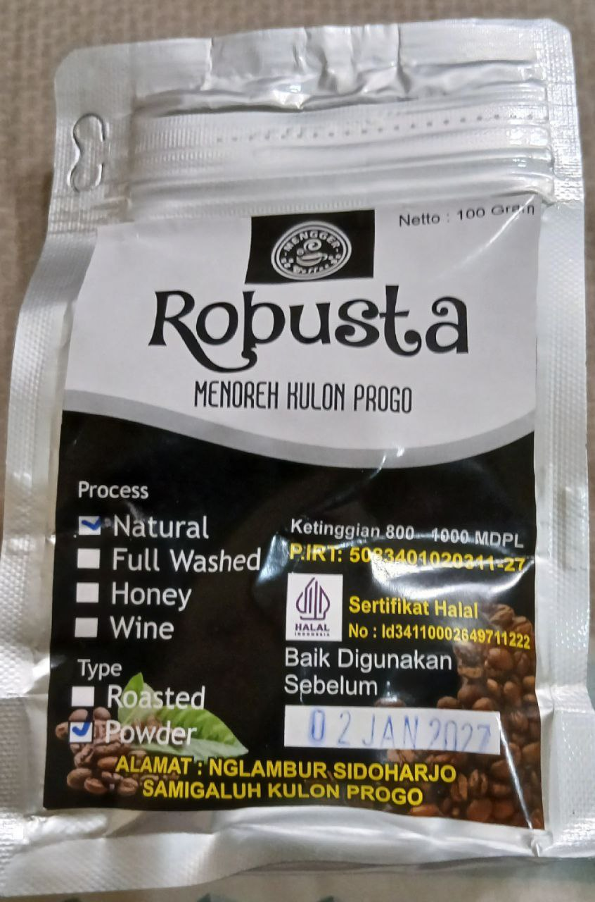

---
tags:
- Coffee
date: 2025-02-01
---

# Exploration \#1

## TB Hendra

- Link: https://bandungbergerak.id/article/detail/53/berkunjung-ke-tb-hendra-taman-baca-tertua-di-bandung
- Location: https://maps.app.goo.gl/zLJ1J5ZfFc78L8es6

dari wanginya arabica
pas dirasain, yes, arabica
tapi uniknya after tastenya robusta
kok bisa ya?

ah mungkin house blend yang mumpuni

## Warung Kopi Purnama

- Link:
    - https://www.instagram.com/warungkopipurnama/
    - https://pergikuliner.com/restaurants/bandung/warung-kopi-purnama-banceuy
- Location: https://maps.app.goo.gl/yj5FAp5KE29c2X449

kopi item pekat khas robusta
dari rasanya robusta sih
pahit
tapi pahitnya gak bikin bosen kaya robusta yang pernah saia minum
enak sih
ini pertama kali ngerasain robusta rasa ini

## Robusta Menoreh Kulon Progo

wangi bubuknya enak banget
gak kaya kapal api
walaupun tampilan sekilas kapal api banget
rasanya sedikit kacang gosong
after tasenya getir
kaya kopi tanah kuburan
wangi hasil seduhnya beda sama wangi kapal api
rada calming
rasanya juga gak bisa dideskripsiin sih
rasa kacang gosongnya itu kaya rasa awal
after tastenya gatau rasa apa cuma tau getir aja

