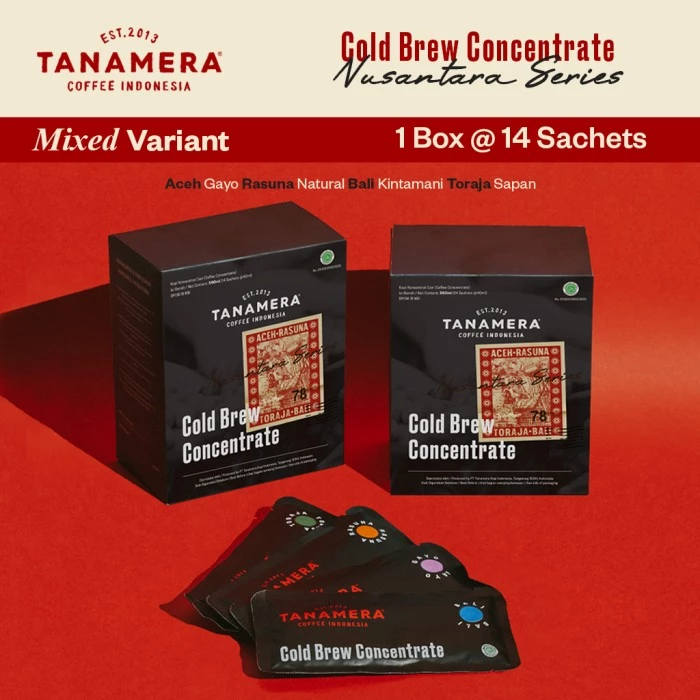
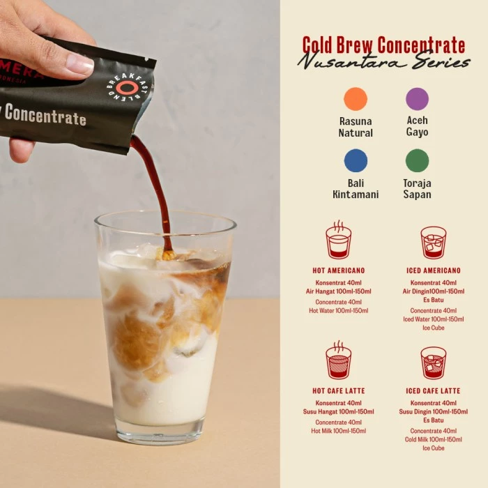
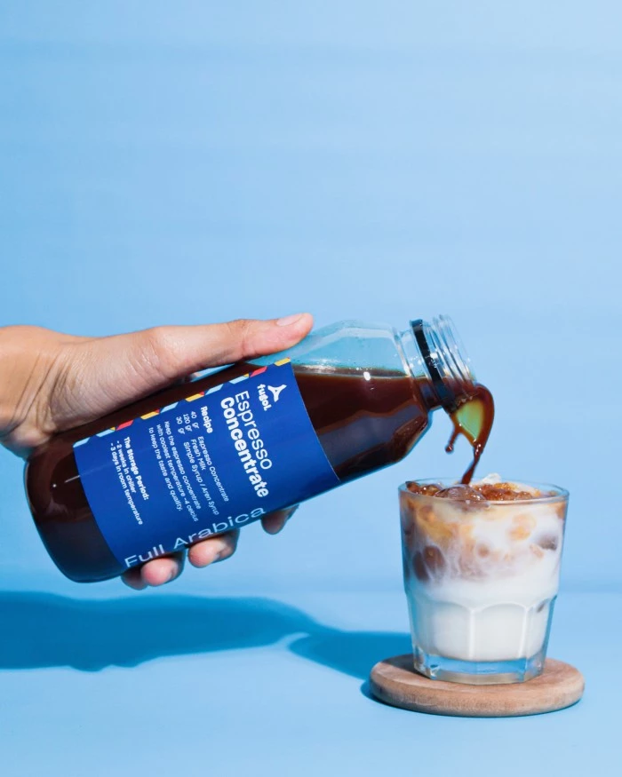
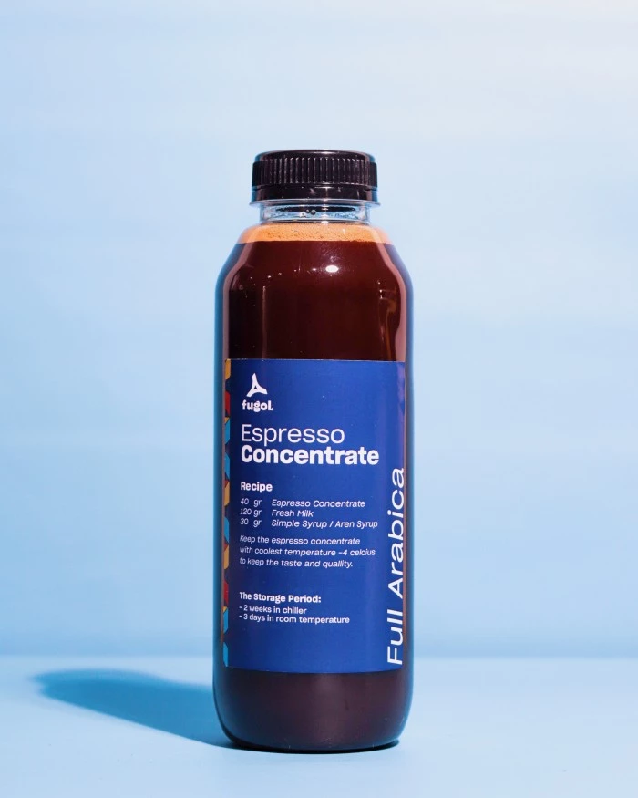

---
tags:
- Coffee
date: 2023-10-29
---

# Simple Recipe

## Dari Youtube

Ini resep simpel buat metode pour over.

<ins>Bubuk Kopi: 30gr</ins>
<ins>Air Panas: 510ml</ins>

Dari resep di atas, rasio kopi = <ins>1:17</ins> (1gr kopi untuk 17ml air). Berarti <ins>setengah porsi = 15gr kopi dan 255ml air</ins>.

## Dari Generative AI

### Rasio

Ini juga resep simpel buat metod pour over.

1. Salah satu rasio yang direkomendasikan adalah <ins>1:16 (1gr kopi untuk setiap 16ml air)</ins>.
2. Rasio lain yang direkomendasikan adalah <ins>1:15.5 (20gr kopi untuk 310ml air)</ins>.
3. Eksperimen dengan rasio <ins>antara 1:15 hingga 1:17</ins>.

### Steps

Berikut adalah langkah-langkah untuk membuat secangkir kopi pour-over yang lezat menggunakan metode <ins>V60</ins> atau <ins>Kalitta</ins> dengan rasio <ins>1:16</ins>:
1. Gunakan <ins>25gr kopi dan 400ml air</ins>.
2. Giling kopi sampai konsistensinya <ins>medium-fine</ins>, mirip dengan garam meja halus.
3. Panaskan air hingga antara <ins>90.56°C dan 96.11°C</ins>.
4. Letakkan filter kertas di perangkat penyaring dan bilas dengan air panas.
5. Tambahkan kopi yang sudah digiling ke dalam filter dan goncangkan perlahan untuk meratakan bubuk.
6. Tuangkan cukup air ke atas bubuk untuk meratakan mereka dan biarkan mereka <ins>"bloom" selama sekitar 30 detik</ins>.
7. Tuangkan sisa air perlahan-lahan ke atas bubuk dengan gerakan melingkar, hindari menuangkan langsung ke atas filter.
8. Waktu penyeduhan total seharusnya <ins>antara 3-4 menit</ins>.

### Dari Daniel Horbat

Before you begin experimenting with your pour over brewing, make sure you have a recipe to follow. This will help to keep your results consistent, which will stop you wasting time and coffee.

Daniel Horbat is a barista from Ireland, and the 2019 World Cup Tasters Champion. <ins>He sticks to the same recipe every time, instead adjusting a single variable</ins> – grind size – when experimenting. “Try to keep everything locked down and play with just a certain variable,” he says.

Daniel also brews small quantities when playing around with recipes: “For me, coffee tastes better when I brew it in a small ratio of around <ins>15g to 250ml</ins>.” He recommends that everyone does this, as it allows them to use a personalised recipe every day to get consistent results.

## Dari Temen

Ini resep simpel buat kopi susu.

<ins>Espresso konsentrat: 50gr</ins>
<ins>Susu Oatside: 150ml</ins>
<ins>Gula Aren: 30ml</ins>

_Note: Espresso konsentrat kaya gini_

**References:**

- [Jual COLD BREW CONCENTRATE SACHETS SINGLE ORIGIN - TANAMERA COFFEE - 1 Box - Kota Tangerang Selatan - Tanamera Coffee | Tokopedia](https://www.tokopedia.com/tanameracoffee/cold-brew-concentrate-sachets-single-origin-tanamera-coffee-1-box-5195d)
- [Jual Espresso Cair / Konsentrat Kopi 500 ml - Full Arabica - Kota Bandung - Fugol Coffee | Tokopedia](https://www.tokopedia.com/fugolcoffee/espresso-cair-konsentrat-kopi-500-ml-full-arabica)

## Experimenting

Ini resep simpel buat kopi susu.

<ins>Vietnam Drip: 150ml</ins>
<ins>Susu Oatside/Banana Milk: 100ml</ins>

Keknya bisa susu apa aja deh 🤔.
