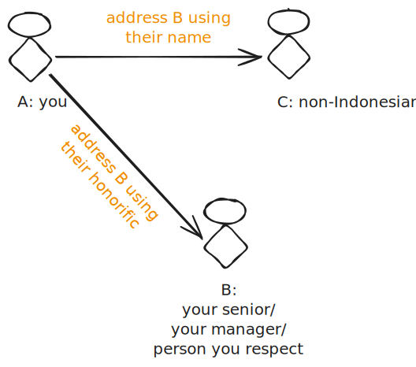

---
tags:
- Communication
- Speaking
date: 2023-05-16
---

# Mas & Mba in English Conversation

## Problem Statement

Jadi suatu hari suatu ketika di pagi yang cerah menjelang makan siang, seorang temen se-team (sebut saja Arkana) nge-post opininya soal penyebutan mas dan mbak di percakapan basa enggres.

Arkana lagi meeting sama team Murica, terus ada yang mungkin sambil ngobrol gitu ada yang manggil mas/mbak ke temen lain di meeting itu. Dan menurut Arkana dan salah satu manager di meeting itu, team Amerika ini bingung, maksudnya apa. Karena kebingungan ini akhirnya Arkana bilang kayanya ini udah saatnya kita stop menggunakan mas/mbak di percakapan enggres.

## Opinion

Menanggapi ini, keknya gak gaya kita deh kaya gitu tanpa honorific. I mean, budaya timur kita lebih menekankan dan menegaskan ke sopan santun dan adab ke yang lebih tua atau ke orang lain yang kita hormati sebagai temen, atasan, orang yang lebih tua, orang yang tidak kita kenal, so on. Ya walau mungkin ada transisi ke arah yang lebih modern yang mungkin bakal menggeser budaya adab tadi tapi keknya better buat tetep dijaga deh.

Mungkin ada benernya kalo kita keep using it, nanti bakal jadi keterusan sewaktu ngobrol ke orang luar. Dengan point of contact yang usually Singaporean, Australian, Americans, somehow make mas/mbak ini dinilai jadi kurang proper. Di luar daripada itu, ada juga kekuatiran kalo nanti malah jadi menyinggung orang lain yang seharusnya mengira kita bakal manggil mereka dengan sopan pake honorific, malah ternyata enggak.

Kalo mau nyinggung culture, Indonesia kan gak sendirian di kondisi ini. Ada Jepang kok, mereka juga selalu pake honorifc -san. Dan mereka selalu pake, juga kita diminta buat pake ketika nge-address mereka. Jepang sendiri selalu "memaksa" culture mereka ke orang selain Jepang. Contohnya di Jepang sendiri mereka lebih comfortable buat diri mereka dan orang asing buat selalu make bahasa Jepang. Itu aja udah ngebuktiin seberapa respect mereka sama budaya sendiri.

Kalo menurut Chat GPT:

> The "-san" honorific is commonly used in Japanese language and culture to show respect
> and politeness when addressing someone. It is an honorific title used after a person's name,
> similar to how "Mr." or "Ms." is used in English.
> The honorific "-san" is a neutral and general form of address and is commonly used in
> various contexts, such as in formal and business settings, as well as in everyday
> conversations. It can be used for both men and women, regardless of their marital status or
> age. It is a default honorific that doesn't imply a close relationship nor formality.
> In Japanese, there are other honorifics like "-sama" (more formal and respectful) or "-chan"
> (used for close friends, children, or in an affectionate manner). The choice of honorific
> depends on the level of formality and familiarity between the speakers.
> When discussing Japanese language or addressing someone in a respectful manner, using
> the "-san" honorific is a common and polite practice. It demonstrates cultural awareness and
> respect for Japanese customs and traditions.

Jadi harusnya gak ada masalah kalo kita juga nge-enforce culture buat nge-address orang-orang yang kita hormati di lingkungan kerja atau pun bukan dengan honorific mas, mbak, pak, bu.

Poin penting lain yang mesti kita catet, di goverment official hearing di Indonesia, semua peserta harus menggunakan bahasa. At least bawa penerjemah. Jadi harusnya bukan alesan buat enggak make.

Jalan tengahnya sih, ya tergantung meeting sama siapa dan soal apa. Kayanya kalo dengan orang yang toleran, harusnya bukan sesuatu yang aneh. Justru malah nunjukin ke bangsa lain buat kita punya manners.

## Summary

Pake berdasarkan kondisi, kalo isinya gak ada orang Indo yang eligible buat dipakein honorific ya gausah pake samsek. Tapi kalo ada yang mungkin bisa diginiin?

