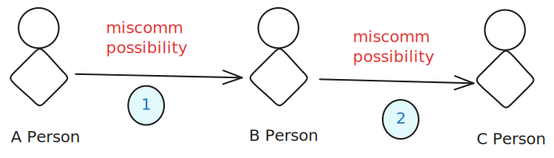
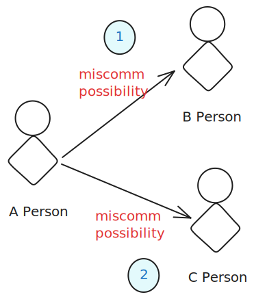

---
tags:
- Communication
date: 2024-02-25
---

# Miscomm

Miskom. Dimana-mana miskom. Ngomong A ketangkepnya B. Ngomong ABX ketangkepnya AX doang.

Biasanya gini nih yang bikin miskom.

Karena si A cuma tau miscomm-nya dari 1 aja. Tapi apa 2 miscomm apa enggak ketauan.

Nah tapi kalo gini.

si A tau kalo 1 sama 2 bisa jadi miscomm dan bisa langsung diklarifikasi.

Mindset-nya adalah kalo intinya berdiskusi, kan udah ada group bersama, ya mention aja semua orang terkait. Kan intinya juga si A minta feedback atau minta persetujuan atau diskusi sama B dan C bareng. Karena kalo gini A jadi tau juga apa pendapat C tanpa harus ngelewatin B dulu yang mana bisa kurang atau nambah atau berubah apa yang disampein C ke B.

