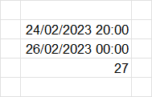
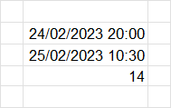

---
tags:
- Excel
date: 2023-02-25
---

# Datetime

## Jumlah jam dari 2 tanggal

Formula:

```C#
=INT((B9-B8)*24)
```

Hasilnya:






**References:**

- [How to Subtract Dates and Times in Excel (exceltrick.com)](https://exceltrick.com/how_to/subtract-dates-and-times-in-excel#Get_Difference_Between_Two_Dates_with_Time_in_Hours)

