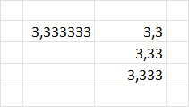
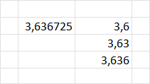
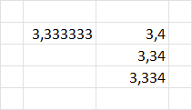
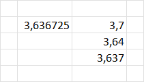

---
tags:
- Excel
date: 2023-02-25
---

# Decimal point

## Simplify decimal point

Misal kita punya angka yang komanya panjang banget mau di-simplify. bisa pake `ROUNDDOWN`.

Formula:

```C#
=ROUNDDOWN(B4;1) // nyisain 1 angka di belakang koma
=ROUNDDOWN(B4;2) // nyisain 2 angka di belakang koma
=ROUNDDOWN(B4;3) // nyisain 3 angka di belakang koma
```

Hasilnya:






## Simplify decimal point dengan buletin ke atas

Kalo tadi pake `ROUNDDOWN`, sekarang pake `ROUNDUP`.

Formula:

```C#
=ROUNDUP(B4;1) // nyisain 1 angka di belakang koma
=ROUNDUP(B4;2) // nyisain 2 angka di belakang koma
=ROUNDUP(B4;3) // nyisain 3 angka di belakang koma
```

Hasilnya:






**References:**

- [Round a number to the decimal places I want - Microsoft Support](https://support.microsoft.com/en-us/office/round-a-number-to-the-decimal-places-i-want-49b936f9-6904-425d-aa98-02ffb7f9a17b)

