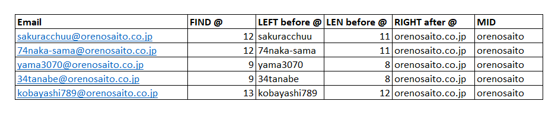

---
tags:
- How-to
- Excel
date: 2023-12-17
---

# String manipulation

## FIND

`FIND` dipake buat nyari index karakter.

Formula:

```C#
=FIND("@";"sakuracchuu@orenosaito.co.jp") // ngasi 12

/*
karena

s a k u r a c c h u  u  @
1 2 3 4 5 6 7 8 9 10 11 12

o  r  e  n  o  s  a  i  t  o  .  c  o  .  j  p
13 14 15 16 17 18 19 20 21 22 23 24 25 26 27 28

*/
```


## LEN

`LEN` buat nyari panjang String.

Formula:

```C#
=LEN("sakuracchuu") // ngasi 12

/*
karena

s a k u r a c c h u  u
1 2 3 4 5 6 7 8 9 10 11

*/
```


## LEFT and RIGHT

`LEFT`, ummm, ya sama kaya namanya ngambil karakter dari kiri String. `RIGHT`, kebalikannya.

Formula:

```C#
=LEFT("sakuracchuu@orenosaito.co.jp";11) // ngasi sakuracchuu

/*
karena

s a k u r a c c h u  u
1 2 3 4 5 6 7 8 9 10 11

*/
```

Atau bisa gini

```C#
=LEFT("sakuracchuu@orenosaito.co.jp";FIND("@";"sakuracchuu@orenosaito.co.jp")-1) // ngasi sakuracchuu

/*
karena

s a k u r a c c h u  u  @
1 2 3 4 5 6 7 8 9 10 11 12

*/
```

Buat `RIGHT`, formula:

```C#
=RIGHT("sakuracchuu@orenosaito.co.jp";16) // ngasi orenosaito.co.jp

/*
karena

o r e n o s a i t o  .  c  o  .  j  p
1 2 3 4 5 6 7 8 9 10 11 12 13 14 15 16

*/
```

Atau bisa gini

```C#
=RIGHT("sakuracchuu@orenosaito.co.jp";LEN("sakuracchuu@orenosaito.co.jp")-FIND("@";"sakuracchuu@orenosaito.co.jp")) // ngasi orenosaito.co.jp
```


## MID

`MID` ini yang paling mirip sama Substring di C#.

```C#
=MID("sakuracchuu@orenosaito.co.jp";13;10) // ngasi orenosaito

/*
karena

s a k u r a c c h u  u  @
1 2 3 4 5 6 7 8 9 10 11 12

o  r  e  n  o  s  a  i  t  o  .  c  o  .  j  p
13 14 15 16 17 18 19 20 21 22 23 24 25 26 27 28

*/
```

Atau bisa juga gini

```C#
=MID("sakuracchuu@orenosaito.co.jp";FIND("@";"sakuracchuu@orenosaito.co.jp") +1;10) // ngasi orenosaito
```


## Implemented

Hasil semuanya kalo diterapin ke Excel:



Formula:

```C#
// FIND @
=FIND("@"; B3)

// LEFT before @
=LEFT(B3;FIND("@";B3)-1)

// LEN before @
=LEN(F3)

// RIGHT after @
=RIGHT(B3;LEN(B3)-FIND("@";B3))

// MID
=MID(B3;FIND("@";B3)+1;10)
```


