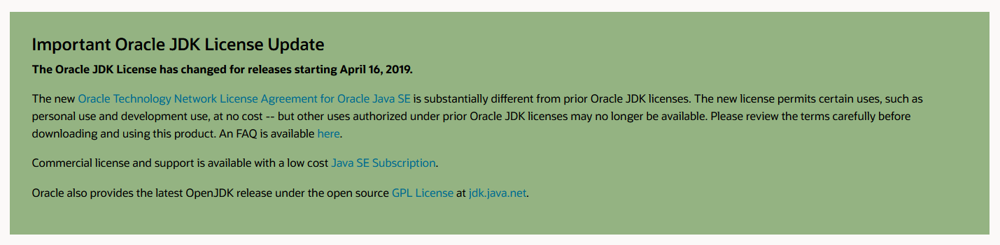
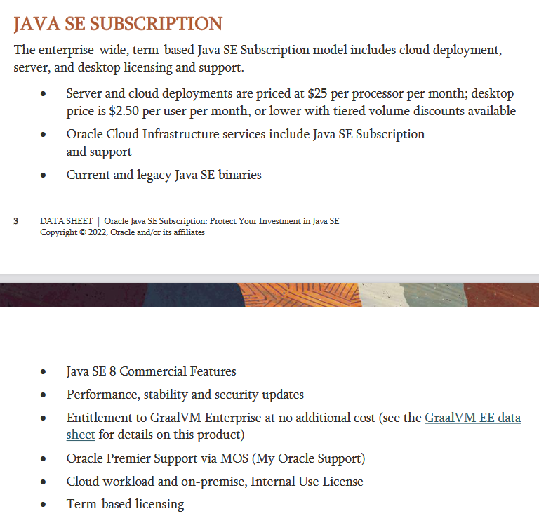
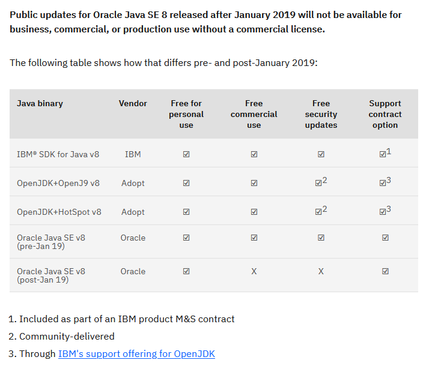
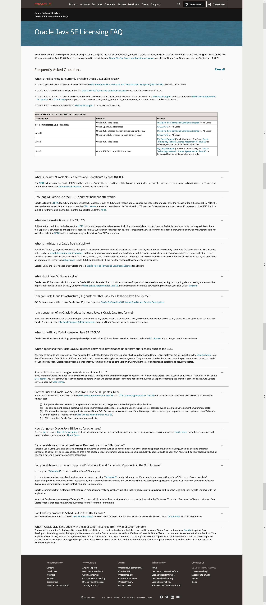

---
tags:
- Java
- License
date: 2022-07-28
---

# Java JDK licensing status

## TLDR;

After 16 April 2019 there is Java SE Subcription

References:

- [Java SE Subscription Datasheet](https://www.oracle.com/a/tech/docs/javase-subscription-datasheet.pdf)

## Java SE 8, Java JDK 11, Java JDK 16

Use [OTN license](https://www.oracle.com/downloads/licenses/oracle-javase-license.html) for personal use, development, testing, prototyping, demonstrating and some other limited uses at no cost

Java SE 8 References:

- Java SE 8 Is No Longer Available Without A License - What Next? ([Video](https://www.youtube.com/watch?v=X_LCUdxJEXw), [Subtitle](_media/Java%20SE%208%20Is%20No%20Longer%20Available%20Without%20A%20License%20-%20What%20Next.srt.md))
- [Java licensing has changed, and you could be affected - IBM Developer](https://developer.ibm.com/blogs/java-licensing-is-changing-and-you-could-be-affected/)
- [IBM and Java: 8, 11, and beyond - IBM Developer](https://developer.ibm.com/blogs/ibm-and-java-8-11-and-beyond/)
- [IBM and Java: The next 25 years - IBM Developer](https://developer.ibm.com/blogs/ibm-and-java-the-next-25-years/)
- [Oracle JDK License General FAQs](https://www.oracle.com/java/technologies/javase/jdk-faqs.html)
- [Oracle Technology Network License Agreement for Oracle Java SE](https://www.oracle.com/downloads/licenses/javase-license1.html)

Java JDK 11 References:

- Oracle Java 11 - A paid trap ([Video](https://www.youtube.com/watch?v=nB7tcf9wnk0), [Subtitle](_media/Oracle%20Java%2011%20-%20A%20paid%20trap.srt.md))
- Which Version of the Java Development Kit Should You Install & Do You Need to Pay for It? ([Video](https://www.youtube.com/watch?v=wv6N2suE_nQ), [Subtitle](_media/Which%20Version%20of%20the%20Java%20Development%20Kit%20Should%20You%20Install%20%26%20Do%20You%20Need%20to%20Pay%20for%20It.srt.md))

Java JDK 16 References:

- [Java Archive Downloads - Java SE 16](https://www.oracle.com/java/technologies/javase/jdk16-archive-downloads.html)

## Java JDK 17

Use [Oracle No-Fee Terms and Conditions License](https://www.oracle.com/downloads/licenses/no-fee-license.html) which permits free use for all users

## Oracle JDK License FAQs

## Alternatives — MSFT Build of OpenJDK

Microsoft Build of OpenJDK is one of no-cost alternatives to the Java runtime. There are a lot of others.

- [OpenJDK](https://openjdk.org/)
- [AdoptOpenJDK - Open source, prebuilt OpenJDK binaries](https://adoptopenjdk.net/) (available with HotSpot VM and Eclipse OpenJ9 VM options)
- [Eclipse Temurin | Adoptium](https://adoptium.net/temurin/)
- [Azul Zulu Builds of OpenJDK](https://www.azul.com/downloads/?package=jdk#download-openjdk)
- [IBM Semeru Runtime (OpenJDK with Eclipse OpenJ9) - Resources and Tools - IBM Developer](https://developer.ibm.com/languages/java/semeru-runtimes/downloads/), [Explore options for downloading IBM Semeru Runtimes - IBM Developer](https://developer.ibm.com/articles/explore-options-for-downloading-ibm-semeru-runtimes/), [OpenJDK and IBM Runtimes for Business | IBM](https://www.ibm.com/cloud/support-for-runtimes)

### Use HotSpot VM

While focused on cloud implementation for Azure, Microsoft Build of OpenJDK still using HotSpot VM. Other cloud-optimized VM as alternatives are:

- [GraalVM](https://www.graalvm.org/) from Oracle
- [Eclipse OpenJ9](https://www.eclipse.org/openj9/) from IBM originally and open-sourced to Eclipse Foundation
- [Azul Zulu Prime Builds of OpenJDK - Azul](https://www.azul.com/products/components/azul-zulu-prime-builds-of-openjdk/) from Azul (this is paid service and only available to Azul Platform Prime subscribers)

### JDK only

JRE must be manually built by using CI/CD pipeline provided.

References:

- [Will you provide a JRE? · Discussion #6 · microsoft/openjdk](https://github.com/microsoft/openjdk/discussions/6)

### No JavaFX support

But you can use OpenJFX from Oracle OpenJDK.

References:

- [Add JavaFX support in Microsoft OpenJDK? · Discussion #286 · microsoft/openjdk](https://github.com/microsoft/openjdk/discussions/286)
- [openjdk/jfx: JavaFX mainline development](https://github.com/openjdk/jfx)

### Differences between other OpenJDKs

At this time it will be mostly the same as others. But MSFT will focus for delivering the runtime for Azure and ARM architecture (this will includes Windows on ARM, Apple silicon, and Linux ARM).

There will be improvements in the future, but not all of those will be accepted upstream (Oracle OpenJDK). But differences will be marked clearly and released as part of MSFT Build of OpenJDK.

References:

- [What&#39;s so special about the Microsoft builds of OpenJDK? · Discussion #158 · microsoft/openjdk](https://github.com/microsoft/openjdk/discussions/158)
- [What&#39;s the difference between this and AdoptOpenJDK for users and developers? · Discussion #15 · microsoft/openjdk](https://github.com/microsoft/openjdk/discussions/15)
- [Question regarding OpenJ9 and Microsoft Differences · Discussion #54 · microsoft/openjdk](https://github.com/microsoft/openjdk/discussions/54)

