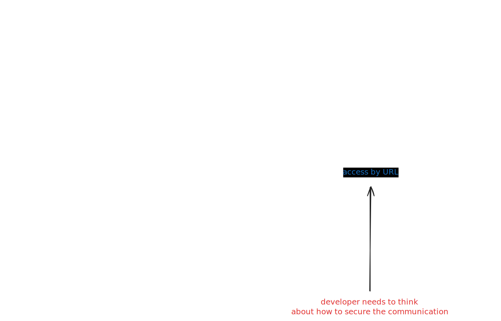

---
tags:
- Javascript
- Deno
date: 2025-04-06
---

# Deno KV

## Previously

Deno KV pertama kali launching di-release buat Deno Deploy. Cloud version atau hosted version dari Deno. Selain dari Deno Deploy, local pun bisa. Tapi built-in 1 instance sama Deno instance-nya. Baca [Deno KV is in Open Beta](https://deno.com/blog/kv-open-beta).

Jadi kalo semisal mau bikin accessible lewat network buat di-access dari berbagain instances, harus bikin App yang nge-layer-in Deno KV-nya.

Misal,




## Currently

Tapi skrg udah disediain dari Deno official make [GitHub - denoland/denokv: A self-hosted backend for Deno KV](https://github.com/denoland/denokv), [Announcing self-hosted Deno KV, continuous backups, and replicas](https://deno.com/blog/kv-is-open-source-with-continuous-backup).

Jadinya kaya gini, dijelasin officially sama Deno-nya.


Buat run self-hosted-nya bisa gini

```cmd
cls
@echo off

set app_dir=%USERPROFILE%\Workspace\App
set mingw64_bin=%USERPROFILE%\Workspace\PortableGit\mingw64\bin
set token_gen_command=%mingw64_bin%\openssl.exe rand -base64 15

for /F "tokens=* USEBACKQ" %%g in (`%token_gen_command%`) do (set access_token=%%g)
echo Access Token: %access_token%

denokv --sqlite-path %app_dir%\appkv.db serve --access-token %access_token%
```

Command ini bakal nampilin access token buat di-copas ke env var dari instance yang mau access Deno KV ini.

Misal dengan struktur gini,

```text
📂 src
 ├ 📂 app
 │  ├ 📄 main.ts
 │  └ 📄 deno.json
 └ 📄 .env
```

Isi code-nya,

```typescript
/** ~< .env file >~ */
DENO_KV_ACCESS_TOKEN=<insert token generated by rundenokv.cmd>


/** ~< deno.json file >~ */
{
  "tasks": {
    "debug": "deno run --env-file=.env --unstable-kv --inspect-wait --allow-all main.ts"
  }
}


/** ~< main.ts file >~ */
try {
    const kv = await Deno.openKv("http://localhost:4512");

    const { value } = await kv.get(["users", "alice"]);
    console.table(value);
}
catch (error) {
    console.error("ERRZ:", error);
}
```