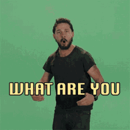

---
tags:
- Life
- Thoughts
date: 2024-01-02
---

# Do it

14 taun lalu kalo gak salah, pas lagi kampanye pemilu, ada kampanye di tv yang slogannya <ins>"Kalo bukan sekarang, kapan lagi. Kalo bukan kita siapa lagi."</ins>.

Kalimat ini bikin,
1. Mau sesulit apapun kondisinya, mau segimanapun kita gak diterimanya, kita tetep berharga di satu bagian. Karena "kalo bukan kita siapa lagi".
2. Mau secapek apapun tapi kalo gak dikerjain ya bakal numpuk, jadi "kalo bukan skrg kapan lagi".

Jangan. Pernah. Berhenti. Bermimpi. Dan Lakuin.

**References:**

- [Prabowo Subianto - Wikipedia bahasa Indonesia, ensiklopedia bebas](https://id.wikipedia.org/wiki/Prabowo_Subianto#Pemiihan_Umum_2009)
- [\[Iklan\] Kalau Bukan Sekarang Kapan Lagi, Kalau Bukan Kita Siapa Lagi - Kompasiana.com](https://www.kompasiana.com/cangkoiburong/5c3e92366ddcae11854efb66/iklan-kalau-bukan-sekarang-kapan-lagi-kalau-bukan-kita-siapa-lagi)
- [KALAU BUKAN KITA, SIAPA LAGI? KALAU BUKAN SEKARANG KAPAN LAGI? - YouTube](https://www.youtube.com/watch?v=1dY0LrlheHA)