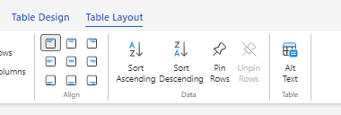
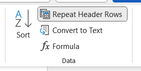
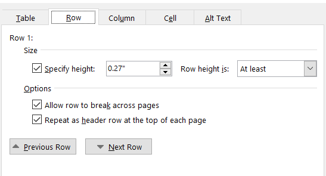

---
tags:
- Office-365
- MS-365
- MS-Office
- Excel
- MS-Excel
date: 2024-07-26
---

# Excel Repeat Header Rows

## Excel Online (Excel Web version)

Pilih `Pin Rows` atau `Unpin Rows`

## Excel Desktop

Pilih `Repeat Header Rows` dari Ribbon Bar

atau

1. select/highlight header-nya
2. terus klik kanan
3. pilih `Table Properties`
4. cari `Repear as header rows on top of each page`

