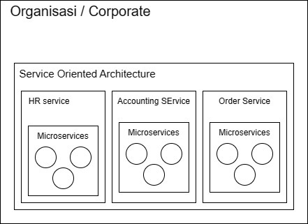
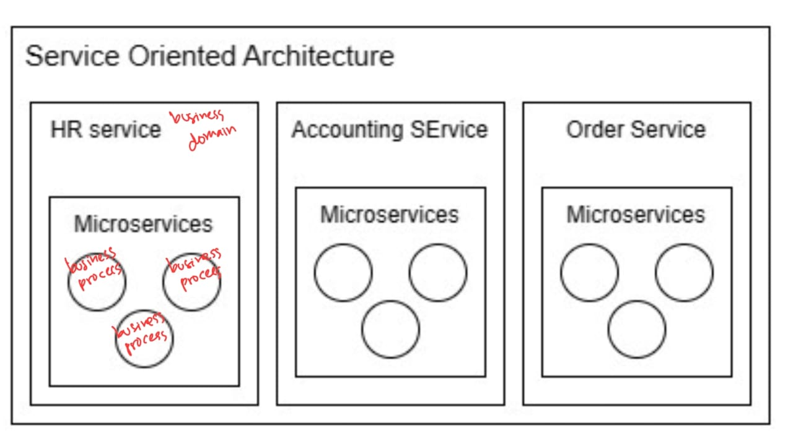

---
tags:
- Research
- Concept
date: 2023-12-17
---

# Microservices Architecture vs Service Oriented Architecture

- [Microservices architecture: Reference diagram - IBM](https://www.ibm.com/cloud/architecture/architectures/)
- [What is SOA (Service-Oriented Architecture)? | IBM](https://www.ibm.com/topics/soa)
- [Service-oriented architecture - IBM](https://www.ibm.com/docs/en/baw/22.x?topic=designer-service-oriented-architecture)
- [SOA vs. Microservices: What’s the Difference? - IBM Blog](https://www.ibm.com/blog/soa-vs-microservices/)

MSA dan SOA tidak lain dan tidak bukan soal scope.
Microservice: scope-nya aplikasi
Service Oriented Architecture: scope-nya organisasi / corporate

Kalo SOA -> domain business
Kalo Microservice -> proses bisnis

