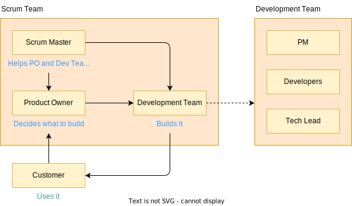

---
tags:
- Work
- Productivity
- Planning
date: 2022-04-06
---

# Scrum

- [Values](#values)
- [Core Values / Theory](#core-values--theory)
- [Events in Scrum](#events-in-scrum)
- [Artifacts](#artifacts)
- [Artifact Commitment](#artifact-commitment)
- [Scrum Team](#scrum-team)
- [Task of Each Role](#task-of-each-role)
- [Relation Visualization](#relation-visualization)
- [Scrum and Agile](#scrum-and-agile)
- [Sprints](#sprints)

## Values

1. Commitment
2. Focus
3. Openness
4. Respect
5. Courage

## Core Values / Theory

1. Transparency
2. Inspection
3. Adaptation

## Events in Scrum

1. Sprint
2. Sprint Planning
3. Daily Scrum
4. Sprint Review
5. Sprint Retrospective

## Artifacts

1. Product Backlog
2. Sprint Backlog
3. Increment

## Artifact Commitment

1. Product Backlog → Product Goal
2. Sprint Backlog → Sprint Goal
3. Increment → Definition of Done

## Scrum Team

1. Product Owner
2. Scrum Master
3. Development Team

## Task of Each Role

1. <ins>Product Owner:</ins> Orders the work for complex problem into Product Backlog.
2. <ins>Scrum Master:</ins> Foster the environment and monitor all events.
3. <ins>Development Team:</ins> Executioner. Turns a selection of work into and increment of value during a Sprint.
4. <ins>Scrum Team + Stakeholders:</ins> Inspect the results and adjust for next Sprint.

**References:**

- [Scrum Guides | The 2020 Scrum GuideTM](https://scrumguides.org/scrum-guides.html)

## Relation Visualization

## Scrum and Agile

Scrum is Agile because of it is delivered to the customer in small regular increments. The feedback will go to the Product Owner then <ins>create of priorities list of features</ins> and user stories <ins>called Product Backlog</ins>.

## Sprints

Scrum team works in a series of Sprints. Commonly in two weeks. Each Sprint started by Sprint Planning attended by Scrum Master, Development Team, and Product Owner. They select <ins>high priorities item that can be delivered by Development Team by single Sprint called Sprint Backlog</ins>.

Each day there is daily Scrum Meeting. What they did yesterday, what they want to do today, and whether they have any blocker.

Sprint ends with <ins>Sprint Review which is a demo of finished function to stakeholders</ins> and a <ins>Sprint Retrospective which examines what went well, what did not, and what could be improved</ins> from the process.

Regular retrospectives can help the team reflect on the past sprint and identify areas for improvement. This can often lead to uncovering the root cause of issues.

**References:**

- [Agile Scrum in Two Minutes](https://www.youtube.com/watch?v=1PBln3dyaPs)

