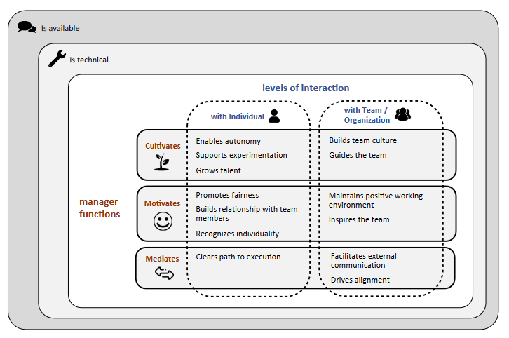

---
tags:
- Work
- Team-Lead
- Manager
- Draft
date: 2023-11-05
---

# Good Leader/Manager

Jadi employee dan team member yang baik aja sulitnya minta ampun. Apalagi jadi manager yang baik. Patokannya apa? Mungkin kita bisa minta feedback dari member. Biasanya [360 feedback](/Work/Work%20—%20Feedback.md).

## Attributes

Microsoft udah bikin research-nya soal ini, ada 15 atribut atau sifat dari Lead/Manager.
1. <ins>Is available/Selalu ada:</ins> Artinya manager ini meluangkan waktu ketika dibutuhkan. Juga approachable. Karena ada manager yang gak approachable jadinya berasa distant jauh gitu. Jadi impact ke komunikasi, impact ke camaraderie. Manager yang selalu ada bisa ngebantu member dengan cara ngejawab pertanyaan-pertanyaan member, ngebantuin kalo ada issue atau feedback dari member. Juga dengan selalu ada ini nunjukin kalo manager ini peduli sama member-member-nya, peduli sama kerjaan member-nya.
Yang bisa dilakuin buat nge-achieve ini ada beberapa:
   - <ins>Jadwalin regular (1:1)</ins> one-on-one ke tiap member dan diskusiin progress, challenges, and goals.
   - <ins>Respond, jawab pertanyaan-pertanyaan member.</ins> Email-nya, call-nya, chat-nya tepat waktu. Inget, tepat waktu. Jawab dengan jelas dan memang menjawab pertanyaannya. Jangan jadi "mirror manager". Apa ity mirror manager? Manager yang kalo ditanya selalu jawab I'll look into it apapun pertanyaannya.
   - <ins>Hadir dan penuh perhatian selama team meetings.</ins> Dorong dan minta member buat share ide dan pendapat-pendapat mereka.
   - <ins>Buat environment yang terbuka dan saling percaya</ins> di mana member nyaman buat reach out lead/manager kapan aja mereka butuh.

---

| Attribute | Description | Representative Quote |
| --- | --- | --- |
| Is available | To signal themselves as approachable and devote time to the engineer when needed | "I ask the manager if he has 5 minutes and he always says yes, and then 20 minutes later he is still there." |
| Is technical | To be knowledgeable about the system and technologies the engineer is working with, understanding the complexity of problems and solutions, and have input for design dilemmas | "The manager keeps up with languages, platforms, development practices. Otherwise they will not have the respect of their team." |
| Enables autonomy | To provide freedom on how engineers work, show trust and support for their decisions, and help engineers be independently responsible | "I tell them where I would like to end up; the way there, they are the ones that know better how to get there." |
| Supports experimentation | To encourage the engineer to try out new things, and signal a safe environment for unsuccessful attempts | "Discovering that something isn’t going work is not a problem, it’s about evaluating what is the best solution." |
| Grows talent | To provide opportunities for challenging work, suggest training for the engineer to gain industry relevant skills, and provide actionable feedback to improve engineer performance | "Your manager is your direct connection to your career; if they’re not giving you good projects you might as well not work here." |
| Promotes fairness | To show appreciation for the engineer’s contributions, hold themselves accountable for the team’s progress, and recognize value publicly while correcting the engineer privately | "Think back to what you liked when you were 5 years old and what made you happy, what was the gold star. Cheerleading, people like it and they want it." |
| Builds a relationship with team members | To take an interest in the employees’ life outside work, and care about them as a person | "Treat them as a friend, I think that is what I learnt, you have to build the relationship first, the work part is much easier." |
| Recognizes individuality | To understand each engineer’s strengths and weaknesses, value diverse perspectives in the team, and fine tune the definition of success to each individual’s talents and interests | "I felt that my manager was interested in what I was doing, you feel like someone’s in your corner and they are rooting for you." |
| Clears path to execution | To shield the engineer from randomization, remove distractions and blockers, and help to resolve issues or conflicts | "I had a manager, she kept the path clear for me to do my work, to go sit down and code for 10 hours. That was perfect." |
| Builds team culture | To demonstrate the rules, norms, and habits of the team, and create “what this team believes in” with input from the team | "We have a culture of openness in the team; very open conversations about what works and what we should improve." |
| Guides the team | To coach engineers on quality aspects (e.g scalability), provide guidance through appropriate questions to engineers struggling with their tasks, and help the engineer build independent decisions making skills | "If the requirements change I don’t want to redesign. I want to make sure they have thought about scalability and extensibility." |
| Maintains a positive working environment | To provide flexibility to balance work and personal life, energize the team through organizing events, celebrate team successes, and ensure good morale | "Take them out to lunch, or have birthday cakes etc. Everyone needs to come in with energy to do their best." |
| Inspires the team | To be viewed as a leader, to respond in situations individually rather than have general approaches, and demonstrate passion about their work, their team, and the company | "In a battle no one follows a manager into war, everyone follows a leader, and it’s about whether you are telling people what to do or if you are coaching them." |
| Facilitates external communication | To act as a buffer with other teams and managers, negotiate what the team can provide when, and mediate their own team’s requests to other teams | "I will make sure it bubbles up and I correspond with my peers to make sure that we get what we need, but you have to not micromanage." |
| Drives alignment | To share information about higher level context, explain the business intent for the product/service, create a mission with input from the team, and set clear goals for the trajectory | "They have to know and believe in it, it’s about what our mission is and why is that important, why does it matter." |

## Importance

Berdasarkan paper Microsoft, ini adalah urutan importance berdasarkan questionnaire spesifik ke software development manager

| Attribute                               | Importance |
| --------------------------------------- | ---------- |
| Grows talent                            | 8.93       |
| Inspires the team                       | 8.43       |
| Drives alignment                        | 8.33       |
| Clears path to execution                | 8.30       |
| Guides the team                         | 8.19       |
| Builds team culture                     | 8.13       |
| Is technical/is domain expert           | 7.89       |
| Facilitates external communication      | 7.86       |
| Builds a relationship with team members | 7.41       |

---

Tapi kalo berdasarkan Conceptual Framework yang disusun penulis paper, yang paling penting disini keliatan, yaitu "Is available" sama "Is technical".

**References:**

- [What Makes a Great Manager of Software Engineers?](https://www.microsoft.com/en-us/research/uploads/prod/2018/06/kalliamvakou-tse-2018.pdf)