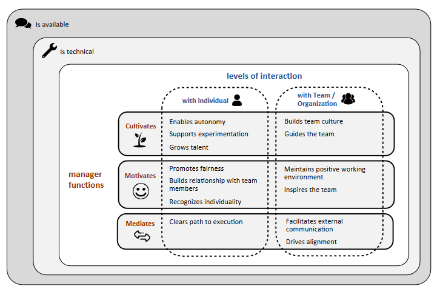

---
tags:
- Work
- Team-Lead
- Manager
- Draft
date: 2023-11-05
---

# Good Leader/Manager

Jadi employee dan team member yang baik aja sulitnya minta ampun. Apalagi jadi manager yang baik. Patokannya apa? Mungkin kita bisa minta feedback dari member. Biasanya [360 feedback](/Work/Work%20—%20Feedback.md).

## Attributes

Microsoft udah bikin research-nya soal ini, ada 15 atribut atau sifat dari Lead/Manager.
1. <ins>Is available/Selalu ada:</ins> Artinya manager ini meluangkan waktu ketika dibutuhkan. Juga approachable. Karena ada manager yang gak approachable jadinya berasa distant jauh gitu. Jadi impact ke komunikasi, impact ke camaraderie. Manager yang selalu ada bisa ngebantu member dengan cara ngejawab pertanyaan-pertanyaan member, ngebantuin kalo ada issue atau feedback dari member. Juga dengan selalu ada ini nunjukin kalo manager ini peduli sama member-member-nya, peduli sama kerjaan member-nya.
Yang bisa dilakuin buat nge-achieve ini ada beberapa:
   - <ins>Jadwalin regular (1:1)</ins> one-on-one ke tiap member dan diskusiin progress, challenges, and goals.
   - <ins>Respond, jawab pertanyaan-pertanyaan member.</ins> Email-nya, call-nya, chat-nya tepat waktu. Inget, tepat waktu. Jawab dengan jelas dan memang menjawab pertanyaannya. Jangan jadi "mirror manager". Apa ity mirror manager? Manager yang kalo ditanya selalu jawab I'll look into it apapun pertanyaannya.
   - <ins>Hadir dan penuh perhatian selama team meetings.</ins> Dorong dan minta member buat share ide dan pendapat-pendapat mereka.
   - <ins>Buat environment yang terbuka dan saling percaya</ins> di mana member nyaman buat reach out lead/manager kapan aja mereka butuh.

<!--
2. <ins>Is technical:</ins> This attribute means that the manager is knowledgeable about the system and technologies the engineer is working with, understands the complexity of problems and solutions, and has input for design dilemmas. A manager who is technical can provide valuable feedback, advice, and direction to the engineer and help them improve their skills and performance. Being technical also shows that the manager respects the engineer's expertise and can communicate with them effectively. Some actionables to achieve this attribute are:
   - Stay updated on the latest trends, tools, and best practices in the software engineering domain and share them with the engineer.
   - Review the engineer's code, design, and architecture and provide constructive and specific feedback.
   - Participate in technical discussions and brainstorming sessions with the engineer and offer suggestions and insights.
   - Help the engineer troubleshoot and debug any issues or errors they encounter and explain the root causes and solutions.
3. <ins>Enables autonomy:</ins> This attribute means that the manager provides freedom on how engineers work, shows trust and support for their decisions, and helps them be independently responsible. A manager who enables autonomy can empower the engineer to take ownership of their tasks, be creative and innovative, and learn from their mistakes. Enabling autonomy also shows that the manager values the engineer's input and contribution and does not micromanage them. Some actionables to achieve this attribute are:
   - Communicate and explain the desired outcome and expectations for the engineer's work, but let them decide on the best approach and methods to achieve them.
   - Delegate tasks and responsibilities to the engineer and give them the authority and resources to complete them.
   - Encourage the engineer to experiment with new ideas and solutions and provide a safe environment for unsuccessful attempts.
   - Support the engineer's decisions and back them up when they face any challenges or conflicts.
4. <ins>Supports experimentation:</ins> This attribute means that the manager encourages the engineer to try out new things and signals a safe environment for unsuccessful attempts. A manager who supports experimentation can help the engineer develop their skills, discover new possibilities, and find the best solution. Supporting experimentation also shows that the manager is open-minded and flexible and does not impose rigid rules or constraints on the engineer. Some actionables to achieve this attribute are:
   - Provide opportunities and time for the engineer to explore new technologies, tools, or techniques and learn from them.
   - Celebrate the engineer's successes and failures and share the lessons learned with the team and the organization.
   - Provide constructive and positive feedback to the engineer and help them improve their experimentation process and outcomes.
   - Protect the engineer from any negative consequences or criticism that may arise from their experimentation.
5. <ins>Grows talent:</ins> This attribute means that the manager provides opportunities for challenging work, suggests training for the engineer to gain industry relevant skills, and provides actionable feedback to improve engineer performance. A manager who grows talent can help the engineer advance and grow in their career, achieve their potential, and increase their satisfaction and engagement. Growing talent also shows that the manager is invested in the engineer's progress and career and wants them to succeed. Some actionables to achieve this attribute are:
   - Identify the engineer's strengths and weaknesses, interests and goals, and tailor their work assignments and development plans accordingly.
   - Recommend and support the engineer's participation in training courses, workshops, conferences, or other learning activities that can enhance their skills and knowledge.
   - Provide regular and specific feedback to the engineer on their work performance and help them set and monitor their goals and action steps.
   - Recognize and reward the engineer's achievements and contributions and provide them with opportunities for promotion or recognition.
6. <ins>Is a good communicator:</ins> This attribute means that the manager is able to effectively convey information and expectations, listen to feedback and concerns, and foster open communication within the team. Some actionables to achieve this attribute are:
   - Clearly articulate goals, expectations, and responsibilities to the engineer.
   - Encourage open and honest communication within the team.
   - Regularly check in with the engineer to understand their challenges and concerns.
7. <ins>Is empathetic:</ins> This attribute means that the manager understands and shares the feelings of the engineer. Some actionables to achieve this attribute are:
   - Show genuine interest in the engineer's well-being and work-life balance.
   - Be understanding and supportive when the engineer is facing challenges.
   - Foster a team culture where everyone's feelings and perspectives are respected.
8. <ins>Is people-oriented:</ins> This attribute means that the manager values the engineer as an individual and not just as an employee. Some actionables to achieve this attribute are:
   - Regularly acknowledge and appreciate the engineer's contributions.
   - Invest time in building a relationship with the engineer.
   - Show interest in the engineer's career aspirations and personal development.
9. <ins>Is self-aware:</ins> This attribute means that the manager has a clear understanding of their own strengths and weaknesses, emotions, and drives. Some actionables to achieve this attribute are:
   - Regularly seek feedback from the engineer and other team members.
   - Reflect on your own behavior and its impact on the team.
   - Be open to personal growth and learning opportunities.
10. <ins>Is supportive of career development:</ins> This attribute means that the manager actively supports and facilitates the engineer's career growth. Some actionables to achieve this attribute are:
    - Discuss career goals with the engineer and provide guidance.
    - Advocate for the engineer's growth opportunities within the organization.
    - Provide constructive feedback to help the engineer improve their skills.
11. <ins>Is trustworthy:</ins> This attribute means that the manager is reliable, honest, and acts with integrity. Some actionables to achieve this attribute are:
    - Be consistent and fair in your actions and decisions.
    - Keep your promises and follow through on commitments.
    - Be transparent and honest in your communication.
12. <ins>Knows the engineer's job:</ins> This attribute means that the manager has a deep understanding of what the engineer does on a daily basis. Some actionables to achieve this attribute are:
    - Spend time learning about the engineer's role and responsibilities.
    - Understand the challenges and complexities the engineer faces in their work.
    - Stay updated on the latest trends and technologies relevant to the engineer's job.
13. <ins>Values the engineer's work/life balance:</ins> This attribute means that the manager respects the engineer's need for a balance between work and personal life. Some actionables to achieve this attribute are:
    - Respect the engineer's working hours and avoid contacting them outside of these hours.
    - Encourage the engineer to take regular breaks and vacations.
    - Foster a team culture that values work/life balance.
14. <ins>Is competent:</ins> This attribute means that the manager has the necessary skills and knowledge to effectively manage the team. Some actionables to achieve this attribute are:
    - Continuously learn and improve your management skills.
    - Understand the technical aspects of the engineer's work.
    - Stay updated on the latest management practices and trends.
15. <ins>Is respectful:</ins> This attribute means that the manager treats the engineer with kindness and consideration. Some actionables to achieve this attribute are:
    - Treat the engineer with kindness and consideration.
    - Value and respect the engineer's ideas and opinions.
    - Foster a team culture that values diversity and inclusion.
-->

---

| Attribute | Description | Representative Quote |
| --- | --- | --- |
| Is available | To signal themselves as approachable and devote time to the engineer when needed | "I ask the manager if he has 5 minutes and he always says yes, and then 20 minutes later he is still there." |
| Is technical | To be knowledgeable about the system and technologies the engineer is working with, understanding the complexity of problems and solutions, and have input for design dilemmas | "The manager keeps up with languages, platforms, development practices. Otherwise they will not have the respect of their team." |
| Enables autonomy | To provide freedom on how engineers work, show trust and support for their decisions, and help engineers be independently responsible | "I tell them where I would like to end up; the way there, they are the ones that know better how to get there." |
| Supports experimentation | To encourage the engineer to try out new things, and signal a safe environment for unsuccessful attempts | "Discovering that something isn’t going work is not a problem, it’s about evaluating what is the best solution." |
| Grows talent | To provide opportunities for challenging work, suggest training for the engineer to gain industry relevant skills, and provide actionable feedback to improve engineer performance | "Your manager is your direct connection to your career; if they’re not giving you good projects you might as well not work here." |
| Promotes fairness | To show appreciation for the engineer’s contributions, hold themselves accountable for the team’s progress, and recognize value publicly while correcting the engineer privately | "Think back to what you liked when you were 5 years old and what made you happy, what was the gold star. Cheerleading, people like it and they want it." |
| Builds a relationship with team members | To take an interest in the employees’ life outside work, and care about them as a person | "Treat them as a friend, I think that is what I learnt, you have to build the relationship first, the work part is much easier." |
| Recognizes individuality | To understand each engineer’s strengths and weaknesses, value diverse perspectives in the team, and fine tune the definition of success to each individual’s talents and interests | "I felt that my manager was interested in what I was doing, you feel like someone’s in your corner and they are rooting for you." |
| Clears path to execution | To shield the engineer from randomization, remove distractions and blockers, and help to resolve issues or conflicts | "I had a manager, she kept the path clear for me to do my work, to go sit down and code for 10 hours. That was perfect." |
| Builds team culture | To demonstrate the rules, norms, and habits of the team, and create “what this team believes in” with input from the team | "We have a culture of openness in the team; very open conversations about what works and what we should improve." |
| Guides the team | To coach engineers on quality aspects (e.g scalability), provide guidance through appropriate questions to engineers struggling with their tasks, and help the engineer build independent decisions making skills | "If the requirements change I don’t want to redesign. I want to make sure they have thought about scalability and extensibility." |
| Maintains a positive working environment | To provide flexibility to balance work and personal life, energize the team through organizing events, celebrate team successes, and ensure good morale | "Take them out to lunch, or have birthday cakes etc. Everyone needs to come in with energy to do their best." |
| Inspires the team | To be viewed as a leader, to respond in situations individually rather than have general approaches, and demonstrate passion about their work, their team, and the company | "In a battle no one follows a manager into war, everyone follows a leader, and it’s about whether you are telling people what to do or if you are coaching them." |
| Facilitates external communication | To act as a buffer with other teams and managers, negotiate what the team can provide when, and mediate their own team’s requests to other teams | "I will make sure it bubbles up and I correspond with my peers to make sure that we get what we need, but you have to not micromanage." |
| Drives alignment | To share information about higher level context, explain the business intent for the product/service, create a mission with input from the team, and set clear goals for the trajectory | "They have to know and believe in it, it’s about what our mission is and why is that important, why does it matter." |

## Importance

Berdasarkan paper Microsoft, ini adalah urutan importance berdasarkan questionnaire spesifik ke software development manager

| Attribute                               | Importance |
| --------------------------------------- | ---------- |
| Grows talent                            | 8.93       |
| Inspires the team                       | 8.43       |
| Drives alignment                        | 8.33       |
| Clears path to execution                | 8.30       |
| Guides the team                         | 8.19       |
| Builds team culture                     | 8.13       |
| Is technical/is domain expert           | 7.89       |
| Facilitates external communication      | 7.86       |
| Builds a relationship with team members | 7.41       |

---

Tapi kalo berdasarkan Conceptual Framework yang disusun penulis paper, yang paling penting disini keliatan, yaitu "Is available" sama "Is technical".

**References:**

-  [What Makes a Great Manager of Software Engineers?](https://www.microsoft.com/en-us/research/uploads/prod/2018/06/kalliamvakou-tse-2018.pdf)