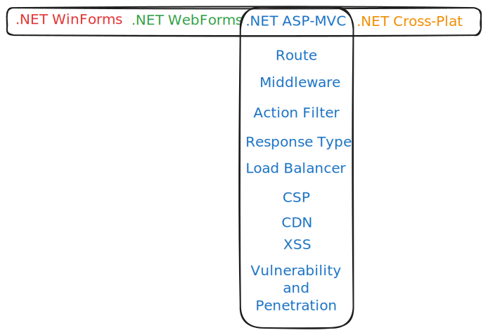

---
tags:
- Work
- Draft
date: 2023-09-30
---

# T Model

## What is

T model ini adalah istilah yang menggambarkan luas dan dalem dari knowledge. Gak cuma soal teknikal. Istilah ini juga berlaku di semua bidang knowledge atau kerjaan.

Setiap orang yang belajar pasti ngalamin kalo pengetahuannya nanti pada akhirnya akan menuju ke T model ini. Garis horizontal T ini maksudnya ngegambarin pemahaman yang luas di berbagai area atau bidang. Garis vertikal T ini maksudnya pemahaman yang dalem ke beberapa area yang lebih spesifik aja.

Kalo di software developing, T model ini menggambarkan pemahaman seorang senior developer yang mampu dipake buat decision making sewaktu nge-design arsitektur dari system yang mau dibangun.

Istilah lainnya yang suka kedengeran itu T-shaped skills, T-shaped persons.

Baca juga [Work — Technical Breadth](/Work/Work%20%E2%80%94%20Technical%20Breadth).

Ini contoh skill yang dipunyai T-shaped person.

**References:**

- [Balance Between Breadth and Depth of Learning Software Development](https://hired.com/blog/candidates/balance-breadth-depth-learning-software-development/)
- [Generalizing Specialists: Improving Your Effectiveness](https://agilemodeling.com/essays/generalizingSpecialists.htm)